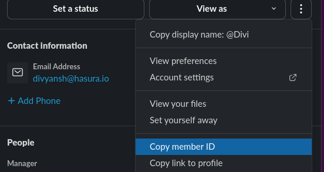
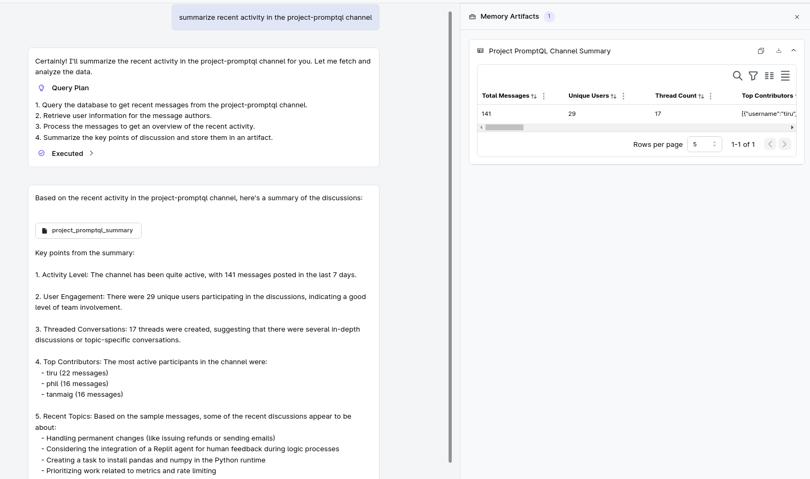
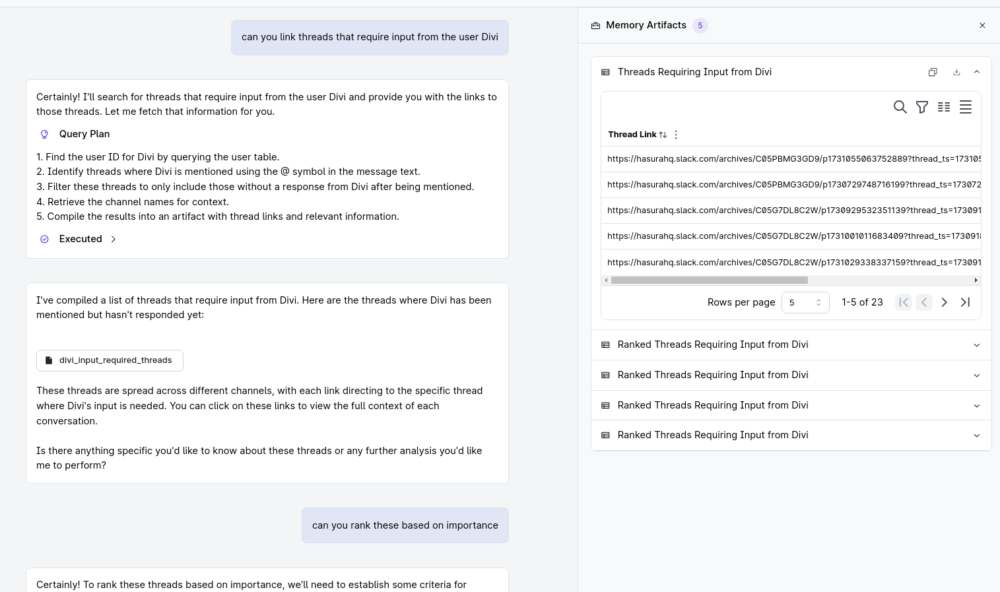
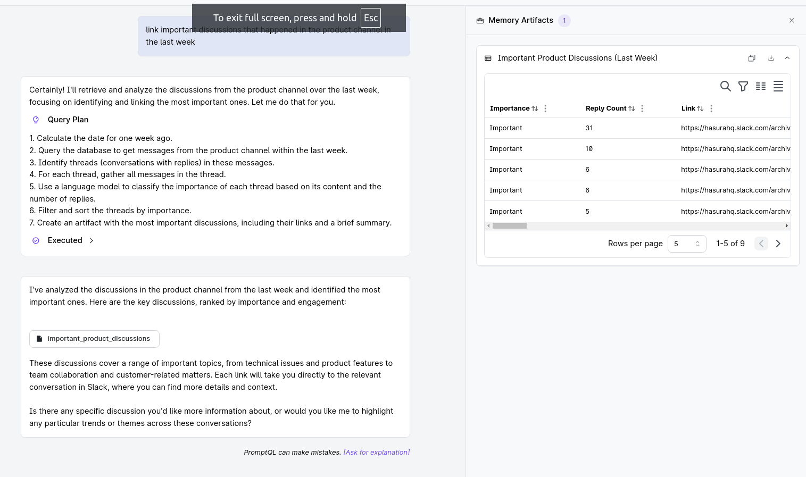
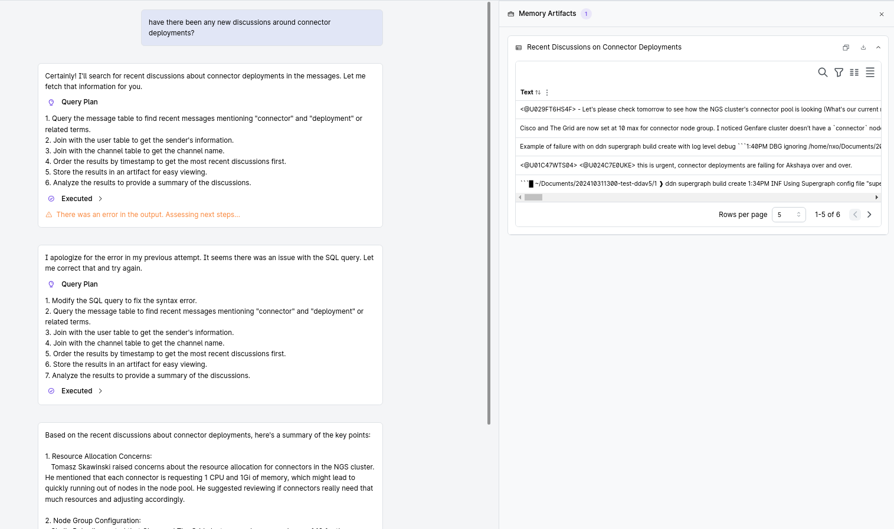
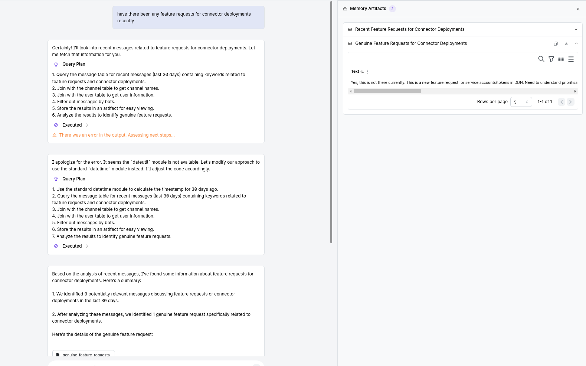

# DDoS (aka Due Diligence on Slack)
### ~~(title is a work in progress)~~

DDoS is an AI assistant built with
[Hasura PromptQL](https://promptql.hasura.io/). DDoS helps you keep track of
activity in your Slack Workspace, and stay on top of all your communications.

This project was inspired by the endless barrage of threads and requests that
I experience when on supporter duty. It becomes increasingly hard to keep 
track of all the threads— which ones are resolved, which are unresolved but
don't need my attention, which are waiting for my input, etc.

Of course, this is not the only thing you can do with ddos. Look at examples 
below for more situations where ddos will prove to be a handy companion.

[Cloud Project](https://console.hasura.io/project/premium-moth-8330)

### Usage

#### Track user

- Get your(or anyone's) Slack user id from the Slack profile. It will look 
something like: `U024C7E0UKE`

  ;

- Run the following mutation
  ```graphql
  mutation TrackUser {
    track_user(user_id: "<user_id>")
  }
  ```


This will load all the threads this user has been tagged in or participated,
and continue to periodically load new messages every 10 minutes.

#### Track channel

- Run the following mutation
  ```graphql
  mutation TrackUser {
    track_user(user_id: "<user_id>")
  }
  ```


This will load all the threads from the given channel, and continue to
periodically load new messages every 10 minutes.


#### Ask Away!

A few examples of the queries you can make:

1. **Summarize a channel**:

    

2. **Get threads that need a user's attention**

    

3. **List and summarize important discussions in a channel**

    

4. **Recent discussion on a specific topic**

    

5. **Feature asks:*

    

